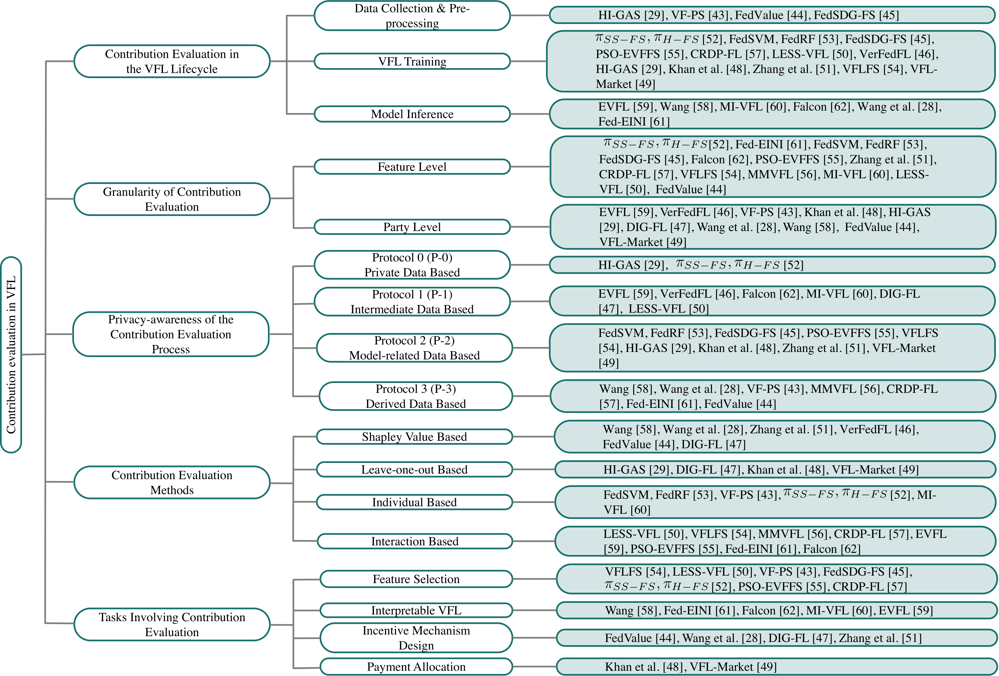
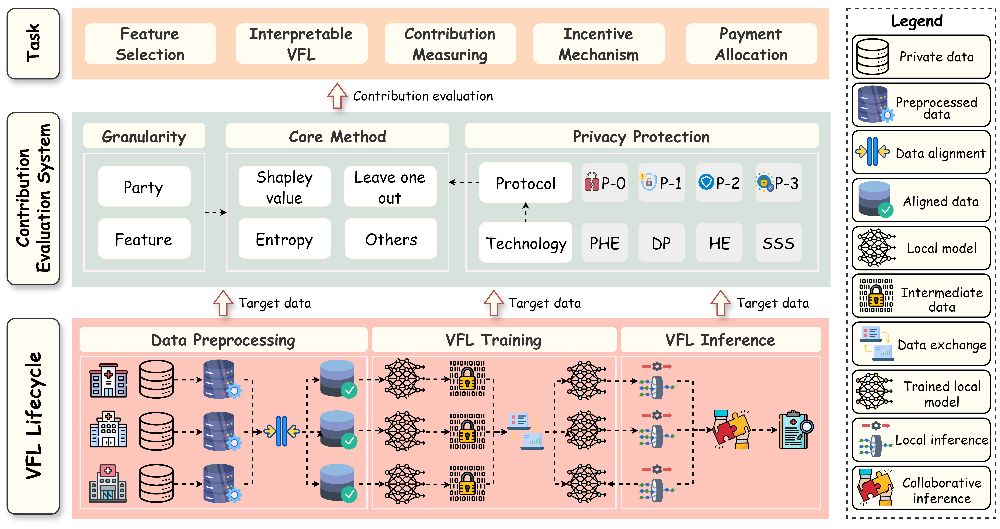

# A Survey on Contribution Evaluation in Vertical Federated Learning

Welcome to the GitHub repo of our [survey paper](https://arxiv.org/abs/2405.02364) on contribution evaluation in VFL!

## Taxonomy Overview

## Contribution Evaluation Workflow

## Contribution Evaluation in the Lifecycle of VFL

### Data Collection and Preprocessing

- Hierarchical Federated Learning Incentivization for Gas Usage Estimation [[paper](https://arxiv.org/abs/2307.00233)]
- VF-PS: How to Select Important Participants in Vertical Federated Learning, Efficiently and Securely? [[paper](https://proceedings.neurips.cc/paper_files/paper/2022/hash/0e1a2388cd2f78069f4d048d935cb218-Abstract-Conference.html)]
- Data Valuation for Vertical Federated Learning: An Information-Theoretic Approach [[paper](https://www.researchgate.net/profile/Junjie-Wu-27/publication/357114901_Data_Valuation_for_Vertical_Federated_Learning_An_Information-Theoretic_Approach/links/62a82d55a3fe3e3df87612a2/Data-Valuation-for-Vertical-Federated-Learning-An-Information-Theoretic-Approach.pdf)]
- FedSDG-FS: Efficient and Secure Feature Selection for Vertical Federated Learning [[paper](https://ieeexplore.ieee.org/abstract/document/10228895/)]

### VFL Training

- Secure Feature Selection for Vertical Federated Learning in eHealth Systems [[paper](https://ieeexplore.ieee.org/abstract/document/9838917/)]
- Failure Prediction in Production Line Based on Federated Learning [[paper](https://link.springer.com/article/10.1007/s10845-021-01775-2)]
- FedSDG-FS: Efficient and Secure Feature Selection for Vertical Federated Learning [[paper](https://ieeexplore.ieee.org/abstract/document/10228895/)]
- An Embedded Vertical-federated Feature Selection Algorithm based on Particle Swarm Optimisation [[paper](https://ietresearch.onlinelibrary.wiley.com/doi/abs/10.1049/cit2.12122)]
- Vertically Federated Learning with Correlated Differential Privacy [[paper](https://www.mdpi.com/2079-9292/11/23/3958)]
- LESS-VFL: Communication Efficient Feature Selection for Vertical Federated Learning [[paper](https://proceedings.mlr.press/v202/castiglia23a.html)]
- Hierarchical Federated Learning Incentivization for Gas Usage Estimation [[paper](https://arxiv.org/abs/2307.00233)]
- Fair and efficient contribution valuation for vertical federated learning [[paper](https://arxiv.org/abs/2201.02658)]
- Incentive Allocation in Vertical Federated Learning Based on Bankruptcy Problem [[paper](https://arxiv.org/abs/2307.03515)]

### Model Inference

- EVFL: An explainable vertical federated learning for data-oriented Artificial Intelligence systems [[paper](https://www.sciencedirect.com/science/article/pii/S1383762122000583)]
- Interpret Federated Learning with Shapley Values [[paper](https://arxiv.org/abs/1905.04519)]
- Distributed Model Interpretation for Vertical Federated Learning with Feature [[paper](https://ieeexplore.ieee.org/abstract/document/10188708/)]
- Falcon: A Privacy-Preserving and Interpretable Vertical Federated Learning System [[paper](https://dl.acm.org/doi/abs/10.14778/3603581.3603588)]
- Measure Contribution of Participants in Federated Learning [[paper](https://ieeexplore.ieee.org/abstract/document/9006179/)]
- Fed-EINI: An Efficient and Interpretable Inference Framework for Decision Tree Ensembles in Vertical Federated Learning [[paper](https://ieeexplore.ieee.org/abstract/document/9671749/)]

## Granularity of Evaluation

### Feature Level

- Secure Feature Selection for Vertical Federated Learning in eHealth Systems [[paper](https://ieeexplore.ieee.org/abstract/document/9838917/)]
- Fed-EINI: An Efficient and Interpretable Inference Framework for Decision Tree Ensembles in Vertical Federated Learning [[paper](https://ieeexplore.ieee.org/abstract/document/9671749/)]
- Failure Prediction in Production Line Based on Federated Learning [[paper](https://link.springer.com/article/10.1007/s10845-021-01775-2)]
- FedSDG-FS: Efficient and Secure Feature Selection for Vertical Federated Learning [[paper](https://ieeexplore.ieee.org/abstract/document/10228895/)]
- Falcon: A Privacy-Preserving and Interpretable Vertical Federated Learning System [[paper](https://dl.acm.org/doi/abs/10.14778/3603581.3603588)]
- An Embedded Vertical-federated Feature Selection Algorithm based on Particle Swarm Optimisation [[paper](https://ietresearch.onlinelibrary.wiley.com/doi/abs/10.1049/cit2.12122)]
- Vertically Federated Learning with Correlated Differential Privacy [[paper](https://www.mdpi.com/2079-9292/11/23/3958)]
- Data Pricing in Vertical Federated Learning [[paper](https://ieeexplore.ieee.org/abstract/document/9880795/)]
- Vertical Federated Learning-based Feature Selection with Non-overlapping Sample [[paper](https://www.sciencedirect.com/science/article/pii/S095741742201291X)]
- MMVFL: A Simple Vertical Federated Learning Framework for Multi-Class Multi-Participant Scenarios [[paper](https://www.mdpi.com/1424-8220/24/2/619)]
- Distributed Model Interpretation for Vertical Federated Learning with Feature [[paper](https://ieeexplore.ieee.org/abstract/document/10188708/)]
- LESS-VFL: Communication Efficient Feature Selection for Vertical Federated Learning [[paper](https://proceedings.mlr.press/v202/castiglia23a.html)]
- Data Valuation for Vertical Federated Learning: An Information-Theoretic Approach [[paper](https://www.researchgate.net/profile/Junjie-Wu-27/publication/357114901_Data_Valuation_for_Vertical_Federated_Learning_An_Information-Theoretic_Approach/links/62a82d55a3fe3e3df87612a2/Data-Valuation-for-Vertical-Federated-Learning-An-Information-Theoretic-Approach.pdf)]

### Party Level

- EVFL: An explainable vertical federated learning for data-oriented Artificial Intelligence systems [[paper](https://www.sciencedirect.com/science/article/pii/S1383762122000583)]
- Fair and efficient contribution valuation for vertical federated learning [[paper](https://arxiv.org/abs/2201.02658)]
- Incentive Allocation in Vertical Federated Learning Based on Bankruptcy Problem [[paper](https://arxiv.org/abs/2307.03515)]
- VF-PS: How to Select Important Participants in Vertical Federated Learning, Efficiently and Securely? [[paper](https://proceedings.neurips.cc/paper_files/paper/2022/hash/0e1a2388cd2f78069f4d048d935cb218-Abstract-Conference.html)]
- Measure Contribution of Participants in Federated Learning [[paper](https://ieeexplore.ieee.org/abstract/document/9006179/)]
- Efficient Participant Contribution Evaluation for Horizontal and Vertical [[paper](https://ieeexplore.ieee.org/abstract/document/9835159/)]
- Hierarchical Federated Learning Incentivization for Gas Usage Estimation [[paper](https://arxiv.org/abs/2307.00233)]
- Interpret Federated Learning with Shapley Values [[paper](https://arxiv.org/abs/1905.04519)]
- A Bargaining-based Approach for Feature Trading in Vertical Federated Learning [[paper](https://arxiv.org/abs/2402.15247)]
- Data Valuation for Vertical Federated Learning: An Information-Theoretic Approach [[paper](https://www.researchgate.net/profile/Junjie-Wu-27/publication/357114901_Data_Valuation_for_Vertical_Federated_Learning_An_Information-Theoretic_Approach/links/62a82d55a3fe3e3df87612a2/Data-Valuation-for-Vertical-Federated-Learning-An-Information-Theoretic-Approach.pdf)]

## The Privacy Issue of Contribution Evaluation

### Protocol 0 (P-0), Private Data Based

- Hierarchical Federated Learning Incentivization for Gas Usage Estimation [[paper](https://arxiv.org/abs/2307.00233)]
- Secure Feature Selection for Vertical Federated Learning in eHealth Systems [[paper](https://ieeexplore.ieee.org/abstract/document/9838917/)]

### Protocol 1 (P-1), Intermediate Data Based

- EVFL: An explainable vertical federated learning for data-oriented Artificial Intelligence systems [[paper](https://www.sciencedirect.com/science/article/pii/S1383762122000583)]
- Fair and efficient contribution valuation for vertical federated learning [[paper](https://arxiv.org/abs/2201.02658)]
- Falcon: A Privacy-Preserving and Interpretable Vertical Federated Learning System [[paper](https://dl.acm.org/doi/abs/10.14778/3603581.3603588)]
- Distributed Model Interpretation for Vertical Federated Learning with Feature [[paper](https://ieeexplore.ieee.org/abstract/document/10188708/)]
- Efficient Participant Contribution Evaluation for Horizontal and Vertical [[paper](https://ieeexplore.ieee.org/abstract/document/9835159/)]
- LESS-VFL: Communication Efficient Feature Selection for Vertical Federated Learning [[paper](https://proceedings.mlr.press/v202/castiglia23a.html)]

### Protocol 2 (P-2), Model-related Data Based

- Failure Prediction in Production Line Based on Federated Learning [[paper](https://link.springer.com/article/10.1007/s10845-021-01775-2)]
- FedSDG-FS: Efficient and Secure Feature Selection for Vertical Federated Learning [[paper](https://ieeexplore.ieee.org/abstract/document/10228895/)]
- An Embedded Vertical-federated Feature Selection Algorithm based on Particle Swarm Optimisation [[paper](https://ietresearch.onlinelibrary.wiley.com/doi/abs/10.1049/cit2.12122)]
- Vertical Federated Learning-based Feature Selection with Non-overlapping Sample [[paper](https://www.sciencedirect.com/science/article/pii/S095741742201291X)]
- Hierarchical Federated Learning Incentivization for Gas Usage Estimation [[paper](https://arxiv.org/abs/2307.00233)]
- Incentive Allocation in Vertical Federated Learning Based on Bankruptcy Problem [[paper](https://arxiv.org/abs/2307.03515)]

### Protocol 3 (P-3), Derived Data Based

- Interpret Federated Learning with Shapley Values [[paper](https://arxiv.org/abs/1905.04519)]
- Measure Contribution of Participants in Federated Learning [[paper](https://ieeexplore.ieee.org/abstract/document/9006179/)]
- VF-PS: How to Select Important Participants in Vertical Federated Learning, Efficiently and Securely? [[paper](https://proceedings.neurips.cc/paper_files/paper/2022/hash/0e1a2388cd2f78069f4d048d935cb218-Abstract-Conference.html)]
- MMVFL: A Simple Vertical Federated Learning Framework for Multi-Class Multi-Participant Scenarios [[paper](https://www.mdpi.com/1424-8220/24/2/619)]
- Vertically Federated Learning with Correlated Differential Privacy [[paper](https://www.mdpi.com/2079-9292/11/23/3958)]
- Fed-EINI: An Efficient and Interpretable Inference Framework for Decision Tree Ensembles in Vertical Federated Learning [[paper](https://ieeexplore.ieee.org/abstract/document/9671749/)]
- Data Valuation for Vertical Federated Learning: An Information-Theoretic Approach [[paper](https://www.researchgate.net/profile/Junjie-Wu-27/publication/357114901_Data_Valuation_for_Vertical_Federated_Learning_An_Information-Theoretic_Approach/links/62a82d55a3fe3e3df87612a2/Data-Valuation-for-Vertical-Federated-Learning-An-Information-Theoretic-Approach.pdf)]

## Contribution Evaluation Methods

### Shapley Value Based

- Interpret Federated Learning with Shapley Values [[paper](https://arxiv.org/abs/1905.04519)]
- Measure Contribution of Participants in Federated Learning [[paper](https://ieeexplore.ieee.org/abstract/document/9006179/)]
- Data Pricing in Vertical Federated Learning [[paper](https://ieeexplore.ieee.org/abstract/document/9880795/)]
- Fair and efficient contribution valuation for vertical federated learning [[paper](https://arxiv.org/abs/2201.02658)]
- Data Valuation for Vertical Federated Learning: An Information-Theoretic Approach [[paper](https://www.researchgate.net/profile/Junjie-Wu-27/publication/357114901_Data_Valuation_for_Vertical_Federated_Learning_An_Information-Theoretic_Approach/links/62a82d55a3fe3e3df87612a2/Data-Valuation-for-Vertical-Federated-Learning-An-Information-Theoretic-Approach.pdf)]
- Efficient Participant Contribution Evaluation for Horizontal and Vertical [[paper](https://ieeexplore.ieee.org/abstract/document/9835159/)]

### Leave-one-out Based

- Hierarchical Federated Learning Incentivization for Gas Usage Estimation [[paper](https://arxiv.org/abs/2307.00233)]
- Efficient Participant Contribution Evaluation for Horizontal and Vertical [[paper](https://ieeexplore.ieee.org/abstract/document/9835159/)]
- Incentive Allocation in Vertical Federated Learning Based on Bankruptcy Problem [[paper](https://arxiv.org/abs/2307.03515)]
- A Bargaining-based Approach for Feature Trading in Vertical Federated Learning [[paper](https://arxiv.org/abs/2402.15247)]

### Entropy Based

- Failure Prediction in Production Line Based on Federated Learning [[paper](https://link.springer.com/article/10.1007/s10845-021-01775-2)]
- Vertical Federated Learning-based Feature Selection with Non-overlapping Sample [[paper](https://www.sciencedirect.com/science/article/pii/S095741742201291X)]
- Secure Feature Selection for Vertical Federated Learning in eHealth Systems [[paper](https://ieeexplore.ieee.org/abstract/document/9838917/)]
- Distributed Model Interpretation for Vertical Federated Learning with Feature [[paper](https://ieeexplore.ieee.org/abstract/document/10188708/)]

### Others

- LESS-VFL: Communication Efficient Feature Selection for Vertical Federated Learning [[paper](https://proceedings.mlr.press/v202/castiglia23a.html)]
- Vertical Federated Learning-based Feature Selection with Non-overlapping Sample [[paper](https://www.sciencedirect.com/science/article/pii/S095741742201291X)]
- MMVFL: A Simple Vertical Federated Learning Framework for Multi-Class Multi-Participant Scenarios [[paper](https://www.mdpi.com/1424-8220/24/2/619)]
- Vertically Federated Learning with Correlated Differential Privacy [[paper](https://www.mdpi.com/2079-9292/11/23/3958)]
- An Embedded Vertical-federated Feature Selection Algorithm based on Particle Swarm Optimisation [[paper](https://ietresearch.onlinelibrary.wiley.com/doi/abs/10.1049/cit2.12122)]
- Fed-EINI: An Efficient and Interpretable Inference Framework for Decision Tree Ensembles in Vertical Federated Learning [[paper](https://ieeexplore.ieee.org/abstract/document/9671749/)]
- Falcon: A Privacy-Preserving and Interpretable Vertical Federated Learning System [[paper](https://dl.acm.org/doi/abs/10.14778/3603581.3603588)]
- EVFL: An explainable vertical federated learning for data-oriented Artificial Intelligence systems [[paper](https://www.sciencedirect.com/science/article/pii/S1383762122000583)]

## Tasks Related to Contribution Evaluation

### Feature Selection

- LESS-VFL: Communication Efficient Feature Selection for Vertical Federated Learning [[paper](https://proceedings.mlr.press/v202/castiglia23a.html)]
- Vertical Federated Learning-based Feature Selection with Non-overlapping Sample [[paper](https://www.sciencedirect.com/science/article/pii/S095741742201291X)]
- VF-PS: How to Select Important Participants in Vertical Federated Learning, Efficiently and Securely? [[paper](https://proceedings.neurips.cc/paper_files/paper/2022/hash/0e1a2388cd2f78069f4d048d935cb218-Abstract-Conference.html)]
- FedSDG-FS: Efficient and Secure Feature Selection for Vertical Federated Learning [[paper](https://ieeexplore.ieee.org/abstract/document/10228895/)]
- Secure Feature Selection for Vertical Federated Learning in eHealth Systems [[paper](https://ieeexplore.ieee.org/abstract/document/9838917/)]
- An Embedded Vertical-federated Feature Selection Algorithm based on Particle Swarm Optimisation [[paper](https://ietresearch.onlinelibrary.wiley.com/doi/abs/10.1049/cit2.12122)]
- Vertically Federated Learning with Correlated Differential Privacy [[paper](https://www.mdpi.com/2079-9292/11/23/3958)]

### Interpretable VFL

- Interpret Federated Learning with Shapley Values [[paper](https://arxiv.org/abs/1905.04519)]
- Fed-EINI: An Efficient and Interpretable Inference Framework for Decision Tree Ensembles in Vertical Federated Learning [[paper](https://ieeexplore.ieee.org/abstract/document/9671749/)]
- Falcon: A Privacy-Preserving and Interpretable Vertical Federated Learning System [[paper](https://dl.acm.org/doi/abs/10.14778/3603581.3603588)]
- Distributed Model Interpretation for Vertical Federated Learning with Feature [[paper](https://ieeexplore.ieee.org/abstract/document/10188708/)]
- EVFL: An explainable vertical federated learning for data-oriented Artificial Intelligence systems [[paper](https://www.sciencedirect.com/science/article/pii/S1383762122000583)]

### Incentive Mechanism Design

- Data Valuation for Vertical Federated Learning: An Information-Theoretic Approach [[paper](https://www.researchgate.net/profile/Junjie-Wu-27/publication/357114901_Data_Valuation_for_Vertical_Federated_Learning_An_Information-Theoretic_Approach/links/62a82d55a3fe3e3df87612a2/Data-Valuation-for-Vertical-Federated-Learning-An-Information-Theoretic-Approach.pdf)]
- Measure Contribution of Participants in Federated Learning [[paper](https://ieeexplore.ieee.org/abstract/document/9006179/)]
- Efficient Participant Contribution Evaluation for Horizontal and Vertical [[paper](https://ieeexplore.ieee.org/abstract/document/9835159/)]
- Data Pricing in Vertical Federated Learning [[paper](https://ieeexplore.ieee.org/abstract/document/9880795/)]

### Payment Allocation

- Incentive Allocation in Vertical Federated Learning Based on Bankruptcy Problem [[paper](https://arxiv.org/abs/2307.03515)]
- A Bargaining-based Approach for Feature Trading in Vertical Federated Learning [[paper](https://arxiv.org/abs/2402.15247)]

### Plain Contribution Measuring

- Measure Contribution of Participants in Federated Learning [[paper](https://ieeexplore.ieee.org/abstract/document/9006179/)]
- Hierarchical Federated Learning Incentivization for Gas Usage Estimation [[paper](https://arxiv.org/abs/2307.00233)]
- Efficient Participant Contribution Evaluation for Horizontal and Vertical [[paper](https://ieeexplore.ieee.org/abstract/document/9835159/)]
- Data Valuation for Vertical Federated Learning: An Information-Theoretic Approach [[paper](https://www.researchgate.net/profile/Junjie-Wu-27/publication/357114901_Data_Valuation_for_Vertical_Federated_Learning_An_Information-Theoretic_Approach/links/62a82d55a3fe3e3df87612a2/Data-Valuation-for-Vertical-Federated-Learning-An-Information-Theoretic-Approach.pdf)]
- Data Pricing in Vertical Federated Learning [[paper](https://ieeexplore.ieee.org/abstract/document/9880795/)]
